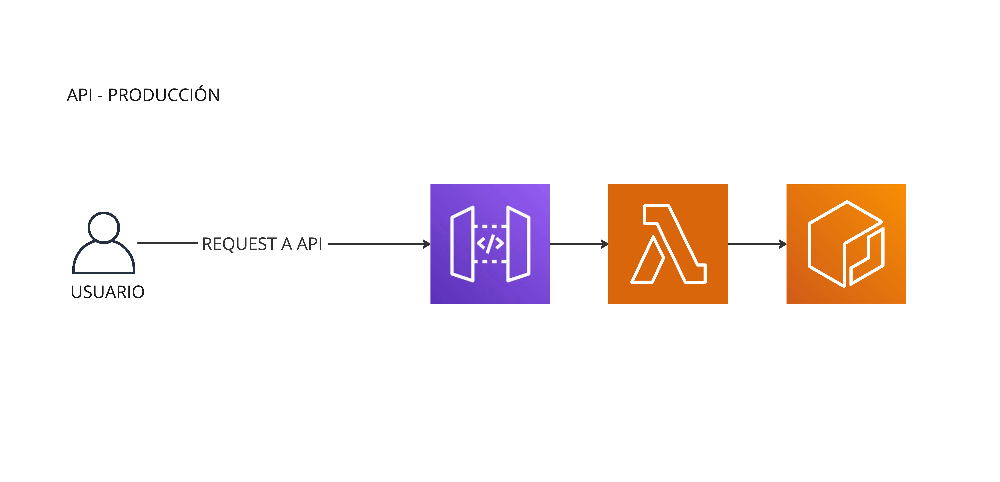
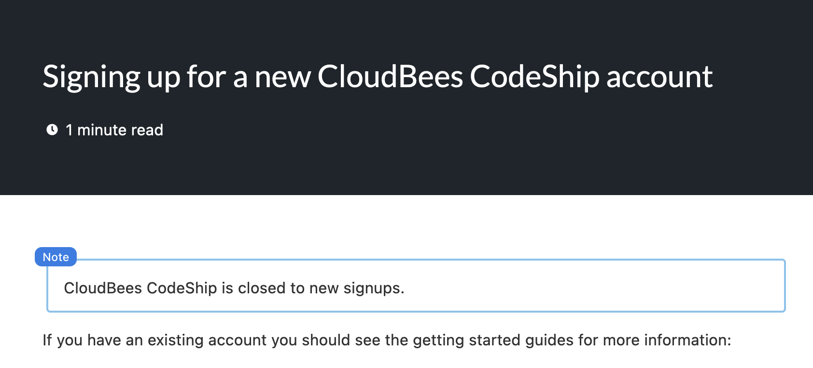

# challenge-neueralworks

Neuralworks challenge

En este repo se encuentra la infraestructura cloud (`terraform`) para el deploy de una API de inferencia de un modelo de ML. El entrenamiento, empaquetado y deploy también se encuentra en este repo.

## Índice de la documentación:
- [challenge-neueralworks](#challenge-neueralworks)
  - [Índice de la documentación:](#índice-de-la-documentación)
- [Documentación API](#documentación-api)
  - [API Methods](#api-methods)
    - [POST /get-prediction](#post-get-prediction)
- [Documentación proyecto para desarrollo](#documentación-proyecto-para-desarrollo)
  - [Algunos *disclaimers*:](#algunos-disclaimers)
  - [Requerimientos del proyecto:](#requerimientos-del-proyecto)
  - [Estructura del repositorio:](#estructura-del-repositorio)
    - [`challenge_neueralworks/`:](#challenge_neueralworks)
    - [`data/`:](#data)
    - [`docs/`:](#docs)
    - [`infra/`:](#infra)
    - [`models/`:](#models)
    - [`notebooks/`:](#notebooks)
  - [Modelos:](#modelos)
  - [CI/CD:](#cicd)
    - [Github Actions:](#github-actions)
    - [Terraform Cloud:](#terraform-cloud)
  - [Desarrollo:](#desarrollo)
    - [Inicio rápido para desarrollo:](#inicio-rápido-para-desarrollo)
  - [Anexos:](#anexos)
    - [CodeShip no vende suscripciones (sad):](#codeship-no-vende-suscripciones-sad)

# Documentación API
La API está protegida y es necesario contar con una API key para poder hacer requests. La API key se debe enviar en el header `x-api-key`. Se enviará una api key por correo.
## API Methods
### POST /get-prediction
```
POST: /get-prediction
Content Tyoe: json
```
Detalle de la request:
||||
|---------------------|----------|----------------------------------------------------------------------|
|  `"DIA-I"`     | [int] | Día programado para el vuelo|
|  `"MES-I"`     | [int] | Mes programado para el vuelo.|
|  `"HORA-I"` | [int] | Hora programada para el vuelo |
|  `"OPERA"` | [String] | Aerolínea que opera el vuelo. Debe estar en el dataset de entrenamiento. De lo contrario fallará con `500 Internal Server Error`. |
|  `"MES"` | [int] | Mes programado para el vuelo.|
|  `"TIPOVUELO"` | [String] | Tipo de vuelo. Puede ser dos valores distintos: `['I', 'N']`. |
|  `"SIGLADES"` | [String] |  Nombre ciudad destino. |
|  `"DIANOM"` | [String] |  Día de la semana de operación del vuelo. Son 7 valores distintos: `['Domingo', 'Lunes', 'Martes', 'Miercoles', 'Jueves', 'Sabado','Viernes']`. |


Example:
```bash
curl --request POST \
  --url https://fx5e3htbyl.execute-api.us-east-1.amazonaws.com/prd/get-prediction \
  --header 'Content-Type: application/json' \
  --header 'x-api-key: <API-KEY>' \
  --data '{
	"DIA-I": 3,
	"MES-I": 2,
	"HORA-I": 9,
	"OPERA": "Grupo LATAM",
	"MES": 2,
	"TIPOVUELO": "N",
	"SIGLADES": "LaSerena",
	"DIANOM": "Viernes"
}'
```

Response:
```json
{
    "statusCode": 200,
    "body": {
        {
            "prediction": [0.859052396297671, 0.14094760370232895]
        }
    }
}
```


# Documentación proyecto para desarrollo
## Algunos *disclaimers*:
- Tengo un error en el nombre del repo (y del paquete en python). Lo dejé así porque no creo que sea tan grave en este momento. Si alcanzo, hago las correcciones necesarias.
- Esta vez, los datos y los notebooks se almacenarán en el mismo repositorio... sé que no es la mejor práctica, pero estoy tratando de mantener las cosas simples.
- El código está escrito en Python 3.10.
- Se utiliza Poetry como gestor de dependencias y paquetes.
- La infraestructura esta en AWS. Si necesitan acceso les puedo crear un usuario y mandar credenciales por correo. Crearía un rol con acceso limitado... la cuenta es personal.
- Para levantar toda la infraestructura se debe tener Terraform instalado y configurado. Se utilizó terraform cloud. También les puedo dar acceso, es mi cuenta personal.
- El CI/CD está utilizando Github Actions. Se intentó crear una cuenta personal en `CodeShip` pero no me dejó crear una cuenta personal (ver imagen del [final](#codeship-no-vende-suscripciones-sad)). Además Github hace fácil hacer distintas reglas en función del nombre de la rama.
- Las pruebas de stress se realizaron con tres herramientas distintas:
  - `wrk`, pero no funcionó para hacer muchas requests concurrentes.
  - `JMeter`, funcionó bien pero para que puedan probar era un poco más engorroso.
  - `Locust`, funcionó bien y es muy fácil de usar. Pueden probar localmente con las instrucciones de la sección <BLAH> de este documento. La gran ventaja es que es Python e instalar como dependencia es fácil. Por otro lado, la interfaz web y los reportes son bien completos.

## Requerimientos del proyecto:
- `python>=3.10`
- `poetry`
- `terraform`
- `Docker`
- Todos los requerimientos de `python` se instalan con `poetry install`.

## Estructura del repositorio:
```bash
├── challenge_neueralworks/
│   └── src/
│       └── models/
│           ├── delay/
│           └── some_other_model/
├── data/
├── docs/
├── infra/
│   ├── api-gateway/
│   ├── ecr/
│   └── lambda/
├── models/
│   ├── delay/
│   └── some_other_model/
├── notebooks/
└── stress_test/
```

Usualmente separo un repositorio con la infraestructura con el desarrollo de código y la API misma. En este caso, por simplicidad, se dejó todo en el mismo repositorio.

### `challenge_neueralworks/`:

- Contiene el código de la API. No se utiliza un framework o librería para esta ya que se implementó con API Gateway y Lambda. Sólo se debe tener un 
`lambda_handler` que reciba un `event` y un `context` y sea capaz de retornar correctamente según la solicitud recibida.
- El `lambda_handler` se encuentra en `challenge_neueralworks/src/lambda_handler.py`.
- Cada modelo nuevo que se quiera manejar en la API se debe implementar en este directorio.

### `data/`:

Contiene los datos utilizados para el entrenamiento del modelo de predicción de atraso de vuelos.

### `docs/`:

Algunos archivos adicionales de la documentación como imágenes o archivos complementarios.

### `infra/`:

En este repo se encuentra toda la infraestructura de AWS utilizada para el deploy de la API. Se utilizó Terraform para la infraestructura. Se utilizó Terraform Cloud para el CI/CD de la infraestructura. No se versiona el terraform state, pero se puede acceder a él en la cuenta de Terraform Cloud.

La documentación particular de la infraestructura se encuentra en [`docs/infra.md`](docs/infra.md). Acá se especifican los recursos utilizados y las razones de cada decisión.

Un resumen de la infraestructura es el siguiente:
API Gateway -> Lambda -> ECR -> Docker -> Modelo de ML

Esto permite escalar de forma económica y rápida. Se deja un diagrama de alto nivel de la infra realizado con Miro:


### `models/`:

Contiene los modelos serializados en formato `pickle` para ser utilizados en la API. Cada modelo debe estar en un directorio con el nombre del modelo. Por ejemplo, el modelo de predicción de atraso de vuelos se encuentra en `models/delay/`.

### `notebooks/`:

Contiene los notebooks utilizados para el desarrollo del modelo de predicción de atraso de vuelos. En particular hay dos:
- `notebooks/to-expose.ipynb`: Notebook entregado inicialmente para el desarrollo del desafío. Como este no se podía ejecutar de forma correcta y arreglar los gráficos y otras cosas rotas podía tomar un rato, se implementó uno desde cero.
- `notebooks/model.ipynb`: Notebook con el desarrollo del modelo de predicción de atraso de vuelos. La documentación está en el notebook. Para instalar los requerimientos, ejecutar `poetry install` y luego `jupyter notebook` para acceder a éste.

## Modelos:

El modelo elegido para la predicción de atraso de vuelos es un modelo de regresión lineal. Se utilizó `sklearn` para el desarrollo del modelo. Se utilizó `dill` para la serialización del modelo.

Cada modelo en producción debe seguir algunas reglas:
1. El modelo debe estar almacenado en la direccion `models/<model_name>/some-name.pkl`
2. Para la serialización del modelo se utilizó `dill`.

Más detalle del entrenamiento en el notebook correspondiente.

## CI/CD:

El deploy de la API se realiza con Github Actions. Se utilizó Terraform Cloud para el CI/CD de la infraestructura. No se versiona el terraform state, pero se puede acceder a él en la cuenta de Terraform Cloud.

### Github Actions:

Se eejecutan distintos jobs:
1. Set stage variable: Esto nos permite tener una variable para identificar si se debe actualizar el ambiente de producción o el ambiente de desarrollo.
2. Configure AWS credentials: Se configuran las credenciales de AWS para poder realizar el deploy de la imagen al ECR y la actualización de la imagen de la Lambda.
3. Login to Amazon ECR: Se loguea en el ECR para poder realizar el deploy de la imagen.
4. Build and tag Docker image: Se construye la imagen de Docker con el modelo y se le asigna un tag.
5. Push Docker image to ECR: Se realiza el push de la imagen al ECR.
6. Update Lambda Image: Se actualiza la imagen de la Lambda con la imagen recién creada.

En caso de la rama `develop`, esto se realiza tanto para los `push` como para los `pull requests`. En caso de la rama `main`, esto se realiza sólo para los `push`. Esto permite realizar pruebas en el ambiente de desarrollo antes de realizar el deploy a producción.

### Terraform Cloud:

Se configuró de forma que se tome el directorio `infra` como el directorio raíz de Terraform. Se dejó la rama `develop` como principal en este repositorio. Esto porque los cambios y pruebas de la infraestructura de `prd` se debiesen realizar antes de pasar los cambios a `main` como release.

## Desarrollo:
### Inicio rápido para desarrollo:

No es necesario tener `terraform` ni `Docker` para desarrollar modelos. La parte de infra debiese estar lista y de `Docker` se encarga github actions.

1. Instalar todas las dependencias de desarrollo con `poetry install`.
2. Comenzar a desarrollar.
   

Para pruebas en local de la API se debe tener Docker andando. 

```bash
docker build -t challenge:latest .
docker run -p 9000:8080  challenge:latest
```

Esto permite hacer solicitudes en el siguiente endpoint:
```bash
curl -XPOST "http://localhost:9000/2015-03-31/functions/function/invocations" -d '{}'
```

Tambien se puede probar de forma momentanea en:
```
https://lpwcrxk52w5tiaq2xaqwdlklem0swjtj.lambda-url.us-east-1.on.aws/
```


## Anexos:
### CodeShip no vende suscripciones (sad):
