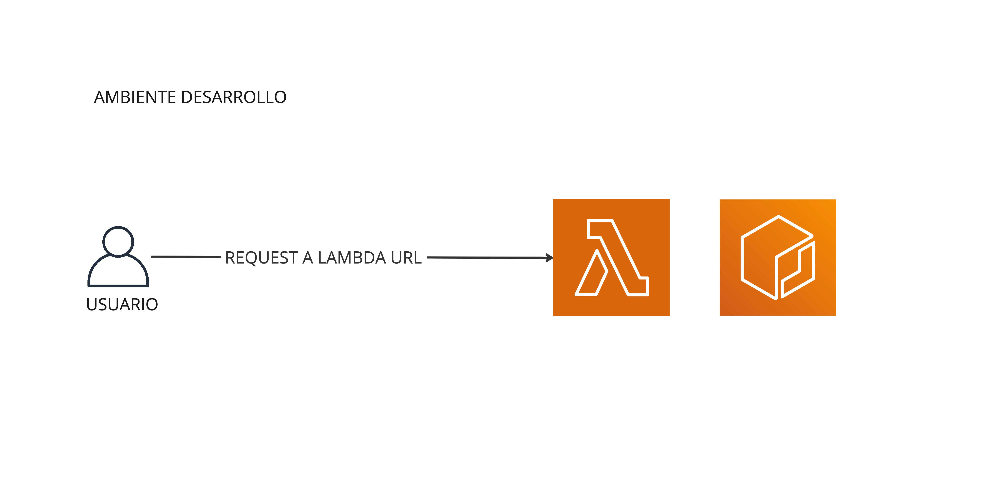
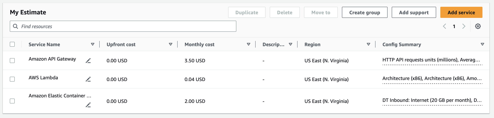

# Documentación infraestructura.

Se realizó un diagrama de alto nivel de esta en [miro](https://miro.com/app/board/uXjVMWB33-4=/?share_link_id=138467065206). Básicamente es una infraestructura serverless, con un API Gateway que se comunica con una función Lambda que hace el deploy de un contenedor de Docker que contiene el modelo de ML:

## Estructura de la infraestructura en PRD

### API Gateway:

Se elige este servicio debido a la escalabilidad, costo y fácil opción de integrar con distintos mecanismos de autenticación. Además, se puede utilizar con Lambda, que es el servicio que se utilizará para el desarrollo de la API.

### Lambda:

Se elige este servicio debido a la escalabilidad, costo y facilidad para hacer deploy de código. Esto mediante el ECR.

### ECR:

Se elige este servicio debido a la facilidad para hacer deploy de contenedores de Docker. Por otro lado, el costo de almacenamiento es muy bajo y el costo de transferencia cuando es entre servicios de AWS en la misma zona es gratuito. Esto permite hacer la cantidad de invocaciones que uno quiera de la Lambda sin aumentar los costos.

## Infra DEV:

Se crearon dos "ambientes" distintos: PRD y DEV. La infra en PRD es lo que se ve arriba. En cambio, la infra en DEV es la siguiente:

La gran diferencia es que se omite un API Gateway. Para hacer pruebas de funcionamiento de la lambda se puede invocar directamented desde la consola de AWS o desde la línea de comandos. Esto permite hacer pruebas de funcionamiento de la lambda sin tener que hacer deploy de la infraestructura completa. 

El CI/CD de github maneja en función del nombre de la rama, a que repositorio del ECR se hace el push de la imagen. En el mismo workflow se actualiza la versión de la imagen en la lambda tomando en cuenta la misma regla. 

Esto permite tener un ambiente de desarrollo para poder experimentar libremente sin romper la API. 

## Precio de la infraestructura:

Se realizó un cálculo aproximado del precio de recibir 1.000.000 de requests al mes tomando en cuenta esta infraestructura. Los resultados están en el doc [`Estimate AWS`](other/My%20Estimate%20-%20AWS%20Pricing%20Calculator.pdf).

Se deja un resumen de los resultados:

Tomando en cuenta la capacidad que tiene esta infraestructura serverless y el costo, se cree que es una decisión acertada. Si se quiere, se puede dejar concurrencia reservada para evitar el *cold start* de la lambda al pasar mucho tiempo dormida. Esto aumenta los costos pero permite tener una mejor experiencia de usuario y menos latencia en la "primera request".